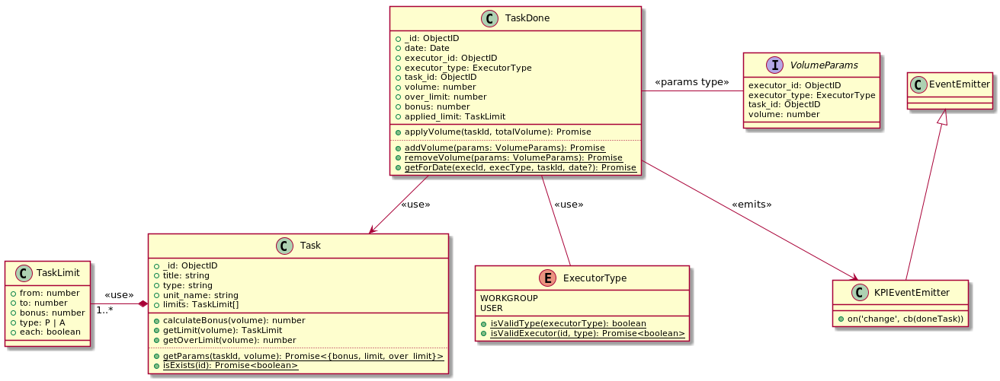

# KPI

## Entity Relationship Diagram


## Class Diagram



## Example

### Tasks table

| _id | title            | type       | unit_name | limits |
|-----|------------------|------------|-----------|--------|
| 1   | Produce a panzer | toy_panzer | quantity  | `[{ from: 0, to: 20, bonus: 0, type: A}, { from: 20, to: 10000, bonus: 100, type: A, each: true}]` |
| 2   | Produce a doll   | toy_doll   | quantity  | `[{ from: 0, to: 50, bonus: 0, type: A}, { from: 50, to: 10000, bonus: 35000, type: A}]`           |

#### Sample Unit Names

- `quantity`
- `kg`
- `liter`

#### each = true

If set to `true`, then calculated `bonus = over_limit * bonus`.

#### type

Some additional business algorithms can be applied by task `type`.
For example, used raw materials can be calculated for `type=toy_doll`.

### Done tasks table

| _id | date       | executor_id | executor_type | task_id | volume | over_limit | bonus | applied_limit |
|-----|------------|-------------|---------------|---------|--------|------------|-------|---------------|
| 1   | 2020-08-05 | 107         | WORKGROUP     | 1       | 30     | 10         | 1000  | `{ from: 20, to: 10000, bonus: 100, type: A, each: true}` |
| 2   | 2020-08-06 | 107         | WORKGROUP     | 1       | 35     | 15         | 1500  | `{ from: 20, to: 10000, bonus: 100, type: A, each: true}` |
| 3   | 2020-08-05 | 11          | USER          | 2       | 47     | 0          | 0     | `{ from: 0, to: 50, bonus: 0, type: A}`         |
| 3   | 2020-08-06 | 11          | USER          | 2       | 58     | 8          | 35000 | `{ from: 50, to: 10000, bonus: 35000, type: A}` |


Keep an applied limit along with the done task.
It helps to analyze & re-calculate a bonus.
It also tracks history of the limit in case of the predefined limit change.

# KPI API

- [Tasks configuration](#tasks-configuration)
- [Increment volume & update KPI](#kpiadd---addsincrements-volume--calculates-kpi-for-the-given-task)
- [Decrement volume & update KPI](#kpidelete---decrements-volume--re-calculates-kpi-for-the-given-task)
- Task Management API
    - [Add a new task](#kpitaskadd---adds-a-task-with-the-given-rules)
    - [Update a task](#kpitaskidupdate---updates-a-task)
    - [Delete a task](#kpitaskiddelete---deletes-a-task)
    - [Get a task](#kpitaskid---gets-a-task)
    - [Get a list of tasks](#kpitask---gets-tasks)

## Tasks configuration

Ensure that the `tasks` collection configured.

Following is the sample task:

```json
{ 
    "_id" : "5f2d0857c8785c46c6d6073a", 
    "title" : "Paint", 
    "type" : "renovation", 
    "unit_name" : "m2", 
    "limits" : [
        {
            "from" : 0.0, 
            "to" : 5.0, 
            "bonus" : 0.0, 
            "type" : "a"
        }, 
        {
            "from" : 5.0, 
            "to" : 99999.0, 
            "bonus" : 100.0, 
            "type" : "a", 
            "each" : true
        }
    ]
}
```

## /kpi/add - adds/increments volume & calculates KPI for the given task

### Request Body Parameters

| Name          | Description            | Example                  |
|---------------|------------------------|--------------------------|
| executor_id   | Task executor ID       | 5ee1a726de443c736f0a66ba |
| executor_type | Task executor type     | `user` or `workgroup`    |
| task_id       | Task ID                | 5f2d0857c8785c46c6d6073a |
| volume        | Volume value | 45                       |

### Response Body Parameters

On success `data` contains the following fields:

| Name          | Description                  | Example                  |
|---------------|------------------------------|--------------------------|
| total_volume  | Total completed volume value | 48                       |
| over_limit    | Over limit volume value      | 8                        |
| bonus         | Calculated bonus value       | 800                      |

### Request

```shell script
curl -L -X POST 'http://127.0.0.1:3000/kpi/add' \
-H 'Accept-Version: 1.0.0' \
-H 'accept-user: admin' \
-H 'Authorization: HsrSgitqSqsYdybqTpxj8c' \
-H 'Content-Type: application/json' \
--data-raw '{
    "executor_id": "5ee1a726de443c736f0a66ba",
    "executor_type": "workgroup",
    "task_id": "5f2d0857c8785c46c6d6073a",
    "volume": 2
}'
```

### Response - success

```json
{
    "statusCode": 200,
    "error": "Ok",
    "message": "Success",
    "data": {
        "total_volume": 8,
        "bonus": 300,
        "over_limit": 3
    }
}
```

### Response - validation errors

```json
{
    "statusCode": 400,
    "error": "Bad Request",
    "message": "body.volume should be > 0"
}
```

```json
{
    "statusCode": 400,
    "error": "Error task_id",
    "message": "task_id"
}
```

```json
{
    "message": "Limits are not configured for the task",
    "statusCode": 400,
    "error": "Bad Request"
}
```

## /kpi/delete - decrements volume & re-calculates KPI for the given task

### Request Body Parameters

| Name          | Description               | Example                  |
|---------------|---------------------------|--------------------------|
| executor_id   | Task executor ID          | 5ee1a726de443c736f0a66ba |
| executor_type | Task executor type        | `user` or `workgroup`    |
| task_id       | Task ID                   | 5f2d0857c8785c46c6d6073a |
| volume        | Volume value to decrement | 1                        |

### Response Body Parameters

On success `data` contains the following fields:

| Name          | Description                  | Example                  |
|---------------|------------------------------|--------------------------|
| total_volume  | Total completed volume value | 48                       |
| over_limit    | Over limit volume value      | 8                        |
| bonus         | Calculated bonus value       | 800                      |

### Request

```shell script
curl -L -X POST 'http://127.0.0.1:3000/kpi/delete' \
-H 'Accept-Version: 1.0.0' \
-H 'accept-user: admin' \
-H 'Authorization: HsrSgitqSqsYdybqTpxj8c' \
-H 'Content-Type: application/json' \
--data-raw '{
    "executor_id": "5ee1a726de443c736f0a66ba",
    "executor_type": "workgroup",
    "task_id": "5f2d0857c8785c46c6d6073a",
    "volume": 2
}'
```

### Response - success

```json
{
    "statusCode": 200,
    "error": "Ok",
    "message": "Success",
    "data": {
        "total_volume": 8,
        "bonus": 300,
        "over_limit": 3
    }
}
```

### Response - validation errors

```json
{
    "statusCode": 400,
    "error": "Bad Request",
    "message": "body.volume should be > 0"
}
```

```json
{
    "statusCode": 400,
    "error": "Error task_id",
    "message": "task_id"
}
```

```json
{
    "message": "Limits are not configured for the task",
    "statusCode": 400,
    "error": "Bad Request"
}
```


## /kpi/task/add - adds a task with the given rules

### Request Body Parameters

| Name          | Description                             | Example                  |
|---------------|-----------------------------------------|--------------------------|
| title         | Task title                              | "Make a meal"            |
| type          | Arbitrary identifier to detect the task | "meal"                   |
| unit_name     | Unit name                               | "qty", "kg"              |
| limits        | Configured limits. Type: Limit[]        |                          |

`Limit` type description:

| Name          | Description                                | Example                  |
|---------------|--------------------------------------------|--------------------------|
| from          | Lower boundary of the limit                | 0                        |
| to            | Upper boundary of the limit                | 10                       |
| bonus         | Bonus value                                | 0                        |
| type          | `a` - amount, `p` - percentage             | a                        |
| each          | `true` - calculate a bonus for each volume | false                    |

### Response Body Parameters

On success `data.task` contains the newly added task.

### Errors

| statusCode | message                                                          |
|------------|------------------------------------------------------------------|
| 400        | Limit "to", "from" values are invalid                            |
| 400        | Duplicate "from" values are detected                             |
| 400        | Duplicate "to" values are detected                               |
| 400        | Next limit must start with the previous limits upper bound value |


### Request

```shell script
curl -L -X POST 'http://127.0.0.1:3000/kpi/task/add' \
-H 'Accept-Version: 1.0.0' \
-H 'accept-user: admin' \
-H 'Authorization: HsrSgitqSqsYdybqTpxj8c' \
-H 'Content-Type: application/json' \
--data-raw '{
    "title": "Taom tayyorlash",
    "type": "meal",
    "unit_name": "qty",
    "limits": [
        {
            "from": 0,
            "to": 5,
            "bonus": 0,
            "type": "a"
        },
        {
            "from": 5,
            "to": 10,
            "bonus": 100,
            "type": "a",
            "each": true
        }
    ]
}'
```

### Response - success

```json
{
    "statusCode": 200,
    "error": "Ok",
    "message": "Success",
    "data": {
        "task": {
            "_id": "5f2e9560047ee10d02a38c11",
            "title": "Taom tayyorlash",
            "type": "meal",
            "unit_name": "qty",
            "limits": [
                {
                    "from": 0,
                    "to": 5,
                    "bonus": 0,
                    "type": "a",
                    "each": false
                },
                {
                    "from": 5,
                    "to": 10,
                    "bonus": 100,
                    "type": "a",
                    "each": true
                }
            ]
        }
    }
}
```

### Response - validation errors

```json
{
    "statusCode": 400,
    "error": "Bad Request",
    "message": "body should have required property 'limits'"
}
```

## /kpi/task/:id/update - updates a task

### Request URL Parameters

| Name          | Description                             | Example                    |
|---------------|-----------------------------------------|----------------------------|
| id            | Task ID to update                       | "5f2ea3f4e803a0317f063df5" |

### Request Body Parameters

| Name          | Description                             | Example                  |
|---------------|-----------------------------------------|--------------------------|
| title         | Task title                              | "Make a meal"            |
| type          | Arbitrary identifier to detect the task | "meal"                   |
| unit_name     | Unit name                               | "qty", "kg"              |
| limits        | Configured limits. Type: Limit[]        |                          |

`Limit` type description:

| Name          | Description                                | Example                  |
|---------------|--------------------------------------------|--------------------------|
| from          | Lower boundary of the limit                | 0                        |
| to            | Upper boundary of the limit                | 10                       |
| bonus         | Bonus value                                | 0                        |
| type          | `a` - amount, `p` - percentage             | a                        |
| each          | `true` - calculate a bonus for each volume | false                    |

### Response Body Parameters

On success `data.task` contains the update task.

### Errors

| statusCode | message                                                          |
|------------|------------------------------------------------------------------|
| 400        | Limit "to", "from" values are invalid                            |
| 400        | Duplicate "from" values are detected                             |
| 400        | Duplicate "to" values are detected                               |
| 400        | Next limit must start with the previous limits upper bound value |


### Request

```shell script
curl -L -X POST 'http://127.0.0.1:3000/kpi/task/5f2ea3f4e803a0317f063df5/update' \
-H 'Accept-Version: 1.0.0' \
-H 'accept-user: admin' \
-H 'Authorization: HsrSgitqSqsYdybqTpxj8c' \
-H 'Content-Type: application/json' \
--data-raw '{
    "title": "Taom tayyorlash 3",
    "type": "meal 3",
    "unit_name": "qty",
    "limits": [
        {
            "from": 0,
            "to": 5,
            "bonus": 0,
            "type": "a"
        },
        {
            "from": 5,
            "to": 10,
            "bonus": 100,
            "type": "a",
            "each": true
        }
    ]
}'
```

### Response - success

```json
{
    "statusCode": 200,
    "error": "Ok",
    "message": "Success",
    "data": {
        "task": {
            "_id": "5f2ea3f4e803a0317f063df5",
            "title": "Taom tayyorlash 3",
            "type": "meal 3",
            "unit_name": "qty",
            "limits": [
                {
                    "from": 0,
                    "to": 5,
                    "bonus": 0,
                    "type": "a",
                    "each": false
                },
                {
                    "from": 5,
                    "to": 10,
                    "bonus": 100,
                    "type": "a",
                    "each": true
                }
            ],
            "__v": 0
        }
    }
}
```

### Response - validation errors

```json
{
    "statusCode": 400,
    "error": "Bad Request",
    "message": "body should have required property 'limits'"
}
```

## /kpi/task/:id/delete - deletes a task

### Request URL Parameters

| Name          | Description                             | Example                    |
|---------------|-----------------------------------------|----------------------------|
| id            | Task ID to delete                       | "5f2ea3f4e803a0317f063df5" |

### Response Body Parameters

On success `data.success` equals to `true`.

### Errors

| statusCode | message                                                          |
|------------|------------------------------------------------------------------|
| 400        | Task not found                                                   |
| 400        | There is a bound workgroup to this task: ${workgroup_name}       |


### Request

```shell script
curl -L -X POST 'http://127.0.0.1:3000/kpi/task/6f2ea3f4e803a0317f063df5/delete' \
-H 'Accept-Version: 1.0.0' \
-H 'accept-user: admin' \
-H 'Authorization: HsrSgitqSqsYdybqTpxj8c'
```

### Response - success

```json
{
    "statusCode": 200,
    "error": "Ok",
    "message": "Success",
    "data": {
        "success": true
    }
}
```

### Response - validation errors

```json
{
    "message": "Task not found",
    "statusCode": 400,
    "error": "Bad Request"
}
```

```json
{
    "message": "There is a bound workgroup to this task: Laklash",
    "statusCode": 400,
    "error": "Bad Request"
}
```

## /kpi/task/:id - gets a task

### Request URL Parameters

| Name          | Description                             | Example                    |
|---------------|-----------------------------------------|----------------------------|
| id            | Task ID to get                          | "5f2ea3f4e803a0317f063df5" |

### Response Body Parameters

On success `data.task` contains a retrieved task.

### Errors

| statusCode | message                                                          |
|------------|------------------------------------------------------------------|
| 400        | Task not found                                                   |


### Request

```shell script
curl -L -X GET 'http://127.0.0.1:3000/kpi/task/5f2e9560047ee10d02a38c11' \
-H 'Accept-Version: 1.0.0' \
-H 'accept-user: admin' \
-H 'Authorization: HsrSgitqSqsYdybqTpxj8c'
```

### Response - success

```json
{
    "statusCode": 200,
    "error": "Ok",
    "message": "Success",
    "data": {
        "task": {
            "_id": "5f2e9560047ee10d02a38c11",
            "title": "Taom tayyorlash",
            "type": "meal",
            "unit_name": "qty",
            "limits": [
                {
                    "from": 0,
                    "to": 5,
                    "bonus": 0,
                    "type": "a",
                    "each": false
                },
                {
                    "from": 5,
                    "to": 10,
                    "bonus": 100,
                    "type": "a",
                    "each": true
                }
            ]
        }
    }
}
```

### Response - validation errors

```json
{
    "message": "Task not found",
    "statusCode": 400,
    "error": "Bad Request"
}
```

## /kpi/task - gets tasks

### Response Body Parameters

On success `data.tasks` contains a list of retrieved tasks.

### Request

```shell script
curl -L -X GET 'http://127.0.0.1:3000/kpi/task' \
-H 'Accept-Version: 1.0.0' \
-H 'accept-user: admin' \
-H 'Authorization: HsrSgitqSqsYdybqTpxj8c'
```

### Response - success

```json
{
    "statusCode": 200,
    "error": "Ok",
    "message": "Success",
    "data": {
        "tasks": [
            {
                "_id": "5f2e9560047ee10d02a38c11",
                "title": "Taom tayyorlash",
                "type": "meal",
                "unit_name": "qty",
                "limits": [
                    {
                        "from": 0,
                        "to": 5,
                        "bonus": 0,
                        "type": "a",
                        "each": false
                    },
                    {
                        "from": 5,
                        "to": 10,
                        "bonus": 100,
                        "type": "a",
                        "each": true
                    }
                ],
                "__v": 0
            },
            {
                "_id": "5f2d0857c8785c46c6d6073a",
                "title": "Paint",
                "type": "renovation",
                "unit_name": "m2",
                "limits": [
                    {
                        "from": 0,
                        "to": 5,
                        "bonus": 0,
                        "type": "a"
                    },
                    {
                        "from": 5,
                        "to": 99999,
                        "bonus": 100,
                        "type": "a",
                        "each": true
                    }
                ]
            }
        ]
    }
}
```
